# Swift Summit

## Flexible Code for Generic Collections
_[Nate Cook](https://twitter.com/nnnnnnnn)_

In addition to the familiar arrays, sets, and dictionaries, the Swift standard library includes a wide range of other collections that enable powerful and efficient transformations. Reaping the benefits of these views and wrappers, however, requires delving into the challenging world of generic and protocol-oriented programming.

This talk will focus on how to get the most out of Swift's sometimes daunting system of collections. We'll explore how the sequence and collection protocols enable different operations, survey the breadth of concrete collection types, and learn how to write methods that can work with any collection.

* Create generic type by using `AnyCollection` and initializer
* Check if all values of an array are true by using protocol (e.g. `extension Sequence where Iterator.Element == Bool`)
* [Legos](https://twitter.com/nnnnnnnn/status/794602968314183680)
* TODO: Go back and review slides (where are slides?)

<sup>[Video]() | [Slides]()</sup>

---

## Swift at Scale
_[Kamilah Taylor](https://twitter.com/kamilah)

## A Quantitive Look at Swift Usage
_[Christopher Stott](https://twitter.com/chrisYVR)_

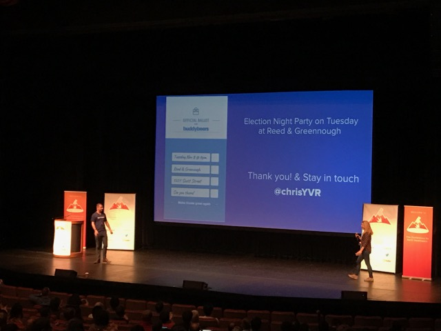

### Getting CI to work with iOS apps isn't easy


* [Buddybuild](https://buddybuild.com/) is a one step solution to get CI/deployment setup
  - Crash reporting with a lot of visuals (instant replays)
  - Slack, Meetup use Buddybuild
* Data from Buddybuild
  - Watch app - 97% of apps do not have a watch app. Lots more with watchOS 2
  - tvOS 99.7% are iOS compared to tvOS
  - 91% use Swift, rest are Hybrid (Cordova, React Native, etc)
    - Reactive Native accounts for 68% of Hybrid apps, 6% of total apps
  - 21% Swift only, 33% Obj C only, rest mixed
  - Only 1% of apps turn off bitcode - must be working well
  - 5% of apps are missing the Podfile.lock from the repo
  - Most popular frameworks:
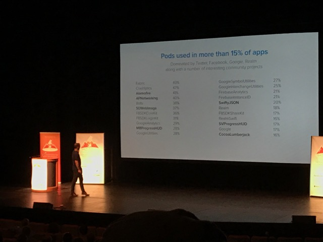
  - 40% of apps do not have tests
  - 16% of apps are actively running tests (out of those using CI)

<sup>[Video]() | [Slides]()</sup>

---

## ProcedureKit and You
_[Jon Shier](https://twitter.com/jshier)_

Operations (formerly NSOperations) are powerful abstractions around asynchronous tasks that provide support for building chains of dependencies to be run in the background. The ProcedureKit library provides enhanced subclasses of Operation, starting with Procedure, that include abilities like conditions, which determine whether an operation can run, capabilities, which allow Procedures to ask the system and your app for permissions, and observers, which offer an easy, closure-based approach to observing the state of procedures. In addition it provides high level procedure wrappers around things like CloudKit, view controller presentation, and UIAlertController presentation.

In this talk, Jon will demonstrate how to use the ProcedureKit library to enhance the asynchronous operation of your apps, from the basic Procedure it offers to it’s more advanced usage. This includes GroupProcedures, which execute multiple procedures as a single task; RepeatedProcedure, which can repeat a procedure until certain conditions are met; and the built in support for result injection, which allows you to communicate results between procedures without tightly coupling them.

<sup>[Video]() | [Slides]()</sup>

---

## Pushing the boundaries of Swift to the Server
_[Chris Bailey](https://twitter.com/Chris__Bailey)_

* Why use Swift on the server?
  - Duration:
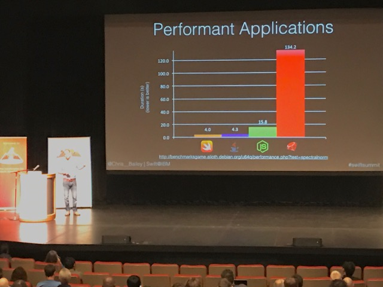
  - Mem usage:
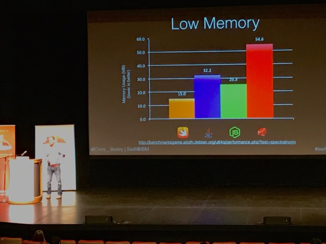
* "Swift Everywhere"
  - Officially supported on macOS and Linux
  - Also IBM LinuxONE, Raspberry Pi, Android
* [Kitura Web Framework](https://github.com/IBM-Swift/Kitura)
  - Adds networking, security, HTTP parsing layers
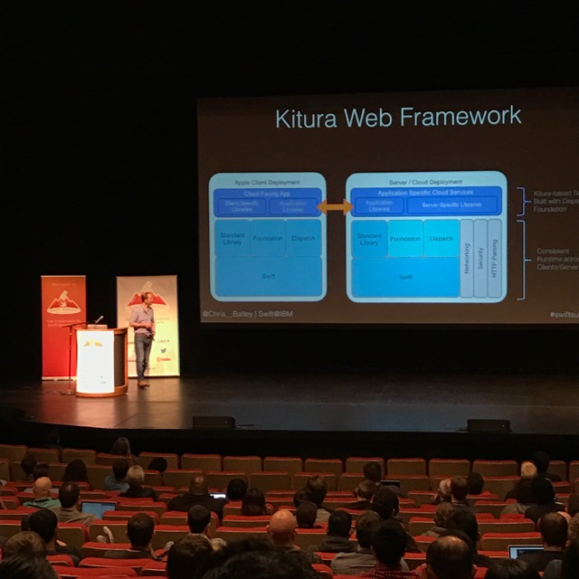

<sup>[Video]() | [Slides]()</sup>

---

## Storyboards Revisited
_[Paul Stringer](https://twitter.com/paulstringer)_

* Why use storyboards?
  - Less boiler-plate
  - Create and preview layout
  - Visualize flow
* The 'Segue' Problem
* Every change in storyboard requires a change in code - nonorthogonal design
* Think declaratively (specifying what is to be done, not how)
* Strongly coupled view controllers increase complication
* Decoupling view controllers by adding a coordinator
* Use protocols to handle `accept` and `visit`

<sup>[Video]() | [Slides]()</sup>

---

## Talking to Swift
_[Alex Gallagher](https://twitter.com/alexisgallagher)_

* With iOS 10, use [SiriKit](https://developer.apple.com/library/prerelease/content/documentation/Intents/Conceptual/SiriIntegrationGuide/CreatingtheIntentsExtension.html#//apple_ref/doc/uid/TP40016875-CH4-SW1) to create new conversational UI
* How do you design a conversational UI?
* What is it?
  1. Messaging as an interaction model
  2. Chatbots (Siri, Google, Amazon Alexa, Xfinity X1, Slackbot... but also voice-base customer service phone tree, automated telephone survey, email spam)
    - chatbots = restricted domain bots
  3. Voice
    - significant progress in speech recognition
* How to design it
  1. Develop a character
  2. Restrict the domain - voice UI is _opposite_ of message thread UI (ex. thread has history accessible, voice has no history)

<sup>[Video]() | [Slides]()</sup>

---

## How to Rescue a Codebase
_[Ben Sandofsky](https://twitter.com/sandofsky)_

* Rewriting a code base is always easier than it seems (Netscape decided to do so and it took 3 years in the middle of the browser wars 😮)
* Two approaches to consider before rewriting the app:
  1. Rewrite layers (sections) with adapters to legacy codes.
    - Pro: Smaller risk
    - Pro: Bundles the rewrite with new functionality
    - Con: Work on interoperability
    - Con: If abandoned, now you have two problems
  2. The Inline Rewrite (fixing things)
    - When going into the codebase, come out leaving things better than the way you found them
    - Test coverage helps pin down other parts of the app that could be effected by refactors
* [Working Effectively with Legacy Code](https://www.amazon.com/Working-Effectively-Legacy-Michael-Feathers/dp/0131177052)
* Tips
  - Don't underestimate preserving existing behavior
  - If you have to rewrite, reduce scope
  - Start with separation of concerns
  - Think in abstractions
  - Leave a trail of tests
  - Focus on small steps. One thing at a time

<sup>[Video]() | [Slides]()</sup>

---

## The Unreasonable Effectiveness of Declarative Code
_[Benjamin Encz](https://twitter.com/benjaminencz)_

* Facts instead of behavior
* Example:
```
usernameLabel.racText <~ user.name
```
* Imperative would be waiting for an action, then updating UI
* Example of implementation in Swift:
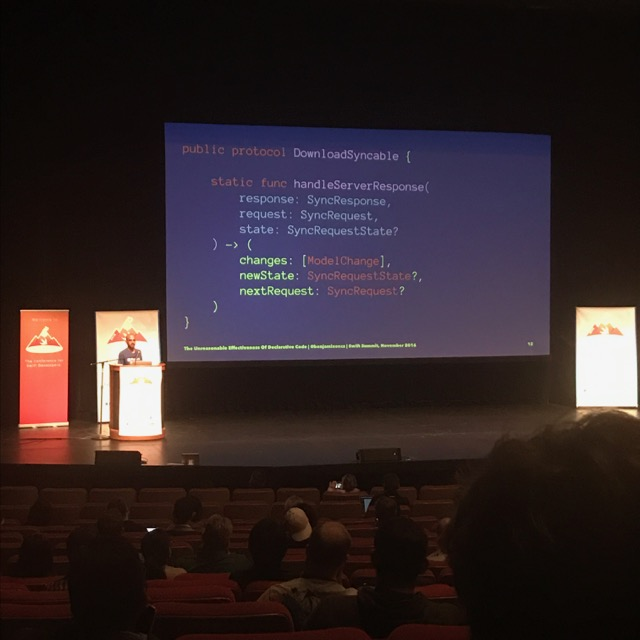
* Further reading:
  - See Slides

<sup>[Video]() | [Slides](https://t.co/toYnGNOjc7)</sup>

---

## Swift & Security
_[Dzung Pham](https://twitter.com/joonefam)_

With security features such as App Transport Security (ATS), crypto framework libraries, etc. Apple has shifted the security decisions from the programming language to the platform. This has influenced the design of Swift into the powerful and intuitive programming language we all know and love. Nevertheless, the security measures provided by the architecture does not guarantee the security of Swift applications.

Improper framework implementation in Swift can create weaknesses and vulnerabilities for attackers to exploit. For example, improper implementation of session management can lead to session hijacking attack or information leakage - sensitive information might be stored locally in the device.

In this presentation, we will go over some main security features that are built into Swift. We will also walk through some abuse cases that make an application vulnerable. Example for improper use of frameworks will be demonstrated.

* Static tooling
  - SSL scanner: sslscan, sslyze, ssllabs
  - Proxy: Burp Suite
  - Reverse Engineering: IDA Pro, Hopper, idb
  - Exploring files: iFile, openSSH

<sup>[Video]() | [Slides]()</sup>

---

## Clear as a Bell: Sharing Technical Expertise
_[Laura Savino](https://twitter.com/savinola)_

* Teachers let students think.
  - Don't answer your own question. Ask your question and wait 7 seconds (other person doesn't realize it's been so long because they're thinking about the problem)
  - Hands behind your back. Forces teacher to describe in words.
  - Ask "Do you want me to try to teach you or do you want me to just tell you?"
  - Search for:
    - Student-centered learning
    - active/passive learning
* Teachers convey why it matters
  - "When am I actually going to need this?"
  - Tell a story (Nate in the first talk used Legos to illustrate)
  - Agree on the problem
  - Search for:
    - ["Thinking Fast and Slow," Daniel Kahneman](https://www.amazon.com/Thinking-Fast-Slow-Daniel-Kahneman/dp/0374533555)
    - ["The Four Phase Model of Interest Development"](http://eric.ed.gov/)
* Teachers make concrete learning objectives
  - Describe specific outcomes. Don't say things like "Make Core Data better," be more specific
  - Search for:
    - "learning objectives" or "outcomes"
    - "learning goals"
    - "Bloom's taxonomy"
* Teachers bring activities to engage with
  - Teaching Git, use a Github of poems
  - Practice
  - Search for:
    - scaffolding
    - guided learning
    - worked examples
* Teachers change gears
  - People will pay attention for `age + 2` 😜
  - Switch it up so your audience stays engaged
* Teachers make students awesomer
* Teachers evaluate
  - Feedback for how lessons worked
  - It's like submitting a pull request without running the code
* Excellent teachers have experience
  - A way out if not a professional teacher: "If you have trouble following, it might be my explanation"
  - We all teach!

<sup>[Video]() | [Slides]()</sup>

---

## Pushing the Limits of Protocol Oriented Programming
_[Jessie Squires](https://twitter.com/jesse_squires)_

* SOLID design principles](https://en.wikipedia.org/wiki/SOLID_%28object-oriented_design%29)
* The "I" in SOLID: No client should depend on (or know about) methods it does not use
  - Small, separated interfaces == focused API
  - Restrict access
  - Unify disjoing types
* Protocols help us write code that:
  1. modular
  2. dynamic
  3. testable
* Protocols+Extensions expand our design space

## Data Consistency in an Unpredictable World
_[Wendy Lu](https://twitter.com/wendyluwho)_

* Move initialization code from `applicationDidFinishLaunching` to background queues, for Pinterest startup time reduced by 50%
* Immutable model layer. Most of the probably with mutability lies in shared state. With an immutable model, you don't have to worry about something else writing to a model while reading it.
* Data builder uses `NSNotificationCenter` to accomplish using immutable models. Checks cache (using [PINCache](https://github.com/pinterest/PINCache)) before making request to the server.

<sup>[Video]() | [Slides]()</sup>

---

## Swift With Hundreds of Engineers
_[Tuomas Artman](https://twitter.com/artman)_

### Motivation

* Old architecture written by 2 engineers - hard to introduce new features
* UX didn't scale (e.g. product slider became too dense for some cities)
* "Let's just change everything"
* 99.99% reliability of core flows (decrease crashes)
* Support Uber's growth for years to come
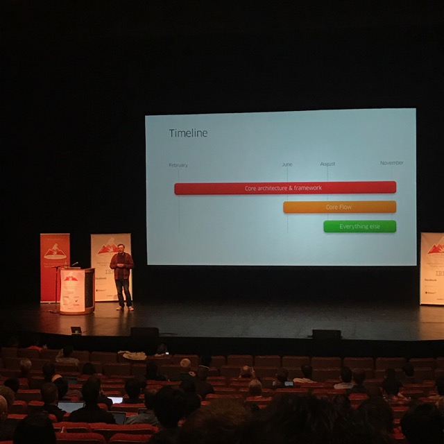

### Architecture

* "Riblets" - Router, Interaction, Builder (and possibility a presenter and a view)
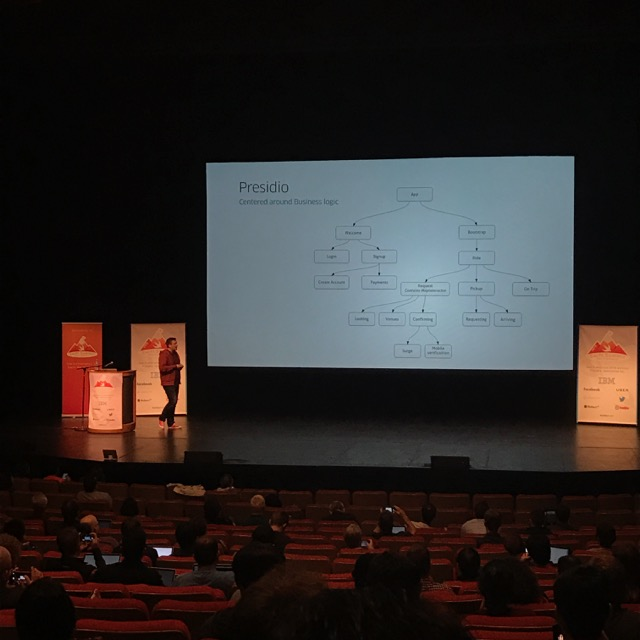

### Learnings

* Swift - the good
  - Great reliability (99.99% crash-free rate target)
  - No implicitly unwrapped options (`person!`)
  - Android engineers more welcome
* Swift - the bad
  - Testing is hard. Developed a script to create mocks due to complexity testing protocols.
  - Tooling issues - CPU usage, processing files
    - Use AppCode as an alternative
    - Contribute back to Nuclide (doesn't yet support Swift)
    - More frameworks
  - Binary size (100mb)
    - Structs are allocated on the stack and can increase binary size
    - Options are implemented as enums and add code you might be unaware of
    - Generics are awesome, but speed comes at a cost
    - Swift runtime libraries
    - Uber wrote a tool to check size by Swift file
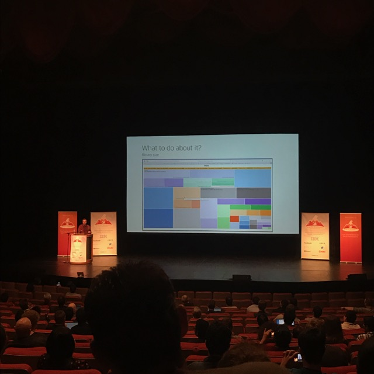
* Swift - the ugly
  - Compile times based on survey

  - Change settings in Xcode, saved build times from 20 minutes to 6 (but you don't get incremental builds)
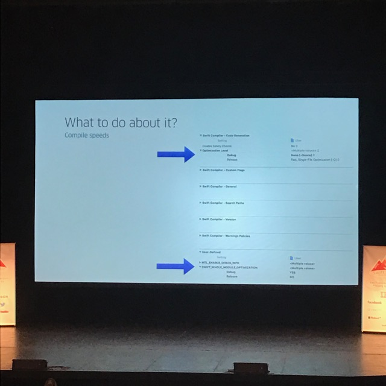

<sup>[Video]() | [Slides]()</sup>

---

## Interfacing with GraphQL is Swift
_[Sammer Panage](https://twitter.com/Sommer)_

This talk will discuss the challenges faced when dealing with dynamic GraphQL queries and responses in a statically typed language such as Swift.

<sup>[Video]() | [Slides]()</sup>

---

## Launch Arguments - The Mysteries
_[Marin Usalj](https://twitter.com/_supermarin)_

* Process arguments (e.g. `ls -l` or `git commit -m <msg>`)
* Set process arguments in scheme in Xcode to change behavior (e.g. look for strings not localized), but they're not documented. 😕

<sup>[Video]() | [Slides]()</sup>

---

## Dynamic Swift
_[Chris Eidhofj](https://twitter.com/chriseidhof)_

In this talk, we'll see why Swift is a very dynamic language. We'll look at an example of runtime programming, which is what made Objective-Cdynamic, and reimplement it using functions, which is what makes Swift dynamic.

* Pattern to create generic function for sorting
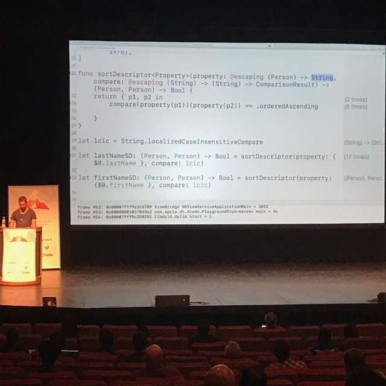
* Refactor using generics
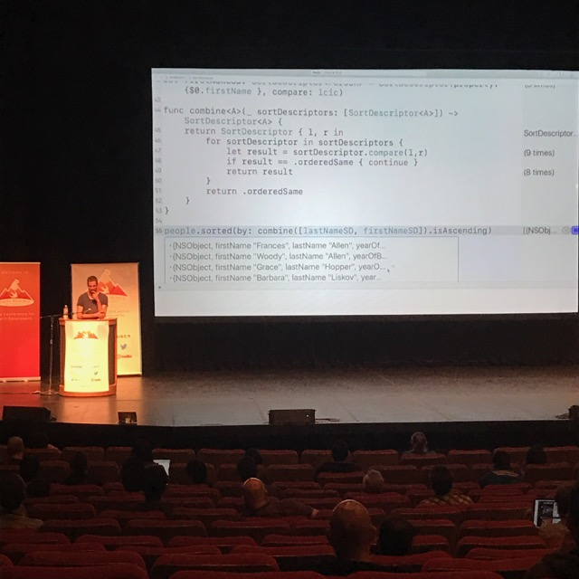

<sup>[Video]() | [Slides]()</sup>

---

## Contributing to the Swift Compiler
_[Ayaka Nonaka](https://twitter.com/ayanonagon)_

A few months ago, I somehow ended up contributing a non-trivial diff to the Swift compiler without much prior experience with C++ and absolutely zero with compilers, and a lot of people have been asking me how I managed to pull that off. This talk will go over how to get up and running with the Swift compiler and how you can contribute too even if it feels completely new and scary!

* Make sure you don't need a proposal for what you're about to do. Check [swift-evolution](https://github.com/apple/swift-evolution)
* Start small (with a bug?)
* It can be hard because there aren't a lot of blog posts, resources out there (not a lot of people have done it)

<sup>[Video]() | [Slides]()</sup>

---

## Rubik's Cubes and Genetic Algorithms in Swift
_[Javier Soto](https://twitter.com/Javi)_

Genetic Algorithms are a fascinating way of solving problems in computer science inspired by biological evolution. I implemented one in Swift to solve Rubik's Cubes, and you won't believe what happened next.

<sup>[Video]() | [Slides]()</sup>

---

## Clarity, Cohesion, Coupling, Complexity
_[Greg Heo](https://twitter.com/gregheo)_

Writers often say the way to become a better writer is to do a lot of reading. The same applies to code: if you take the time to read Swift code—both good and bad—it will expand your horizons and make you a better programmer.

In this talk, Greg will take you through some bits of the open-source Swift repository. We’ll use the four C's—clarity, cohesion, coupling, and complexity—as a lens to examine coding practices. You'll get a look at how parts of Foundation and the standard library are built in Swift, and the goal is to come away with some new ideas and best practices to use in your own projects and build up your skills.

* First step to writing better code, _read_ more code
* See slides for suggestions on how to write better code

<sup>[Video]() | [Slides]()</sup>

---

## Swift Enums and State Machines
_[Christina Lee](https://twitter.com/RunChristinaRun)_

* Why Enums?
  - Type safe
  - Give compile time warnings
  - Built in case logic
* Models use reducers to update enum cases
* Reducers link a UI event to what the new state should be
* View controller binds state to UI - makes view controller simple
* All the heavy lifting is done in reducers (easy to reason about because they're granular)

<sup>[Video]() | [Slides]()</sup>
